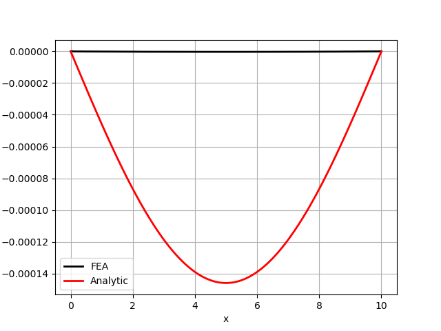

# Simply Supported Beam Deflection Under Own Weight

This repository contains the implementation and analysis of a simply supported beam deflected under its own weight using the Finite Element Method (FEM).

## Problem Description

A beam of length L, Young's modulus E, and moment of inertia I is supported by simple supports at both ends (x=0 and x=L). It deflects due to its own weight, represented by a uniformly distributed load q (force per unit length).


## Analytical Solution

The analytical solution for the deflection \( w(x) \) of a simply supported beam under a uniform load \( q \) is given by the following equation derived from Euler-Bernoulli beam theory:

```
y = (-rho*g/(24*E*I))*(x**4 - 2*length*x**3 + length**3*x)
```

## Simulation vs. Analytical Results

This plot compares the deflection obtained from the FEM simulation with the analytical solution using the quadratic quadrilateral elements.


## Convergence Analysis

### p and h-Refinement

This plot shows the convergence of the solution as the polynomial order (p) of the elements and the number of degrees of freedom is increased.


### Where FEM fails?
* Choosing the solver type can also be important: Even having a fine mesh but doesn't guarantee convergence. for example here I have used Q2 elements with 6k dofs but with `gamg` preconditioner:

* Using a coarse mesh with linear elements (P1) will fail to converge to the analytical solution.

## How to Run
1. First install fenicsx
2. Then run the `automation.py` script to run the simulation for different mesh sizes and polynomial orders.
3. Then run the `postprocess.py` script to plot the convergence of the solution.
